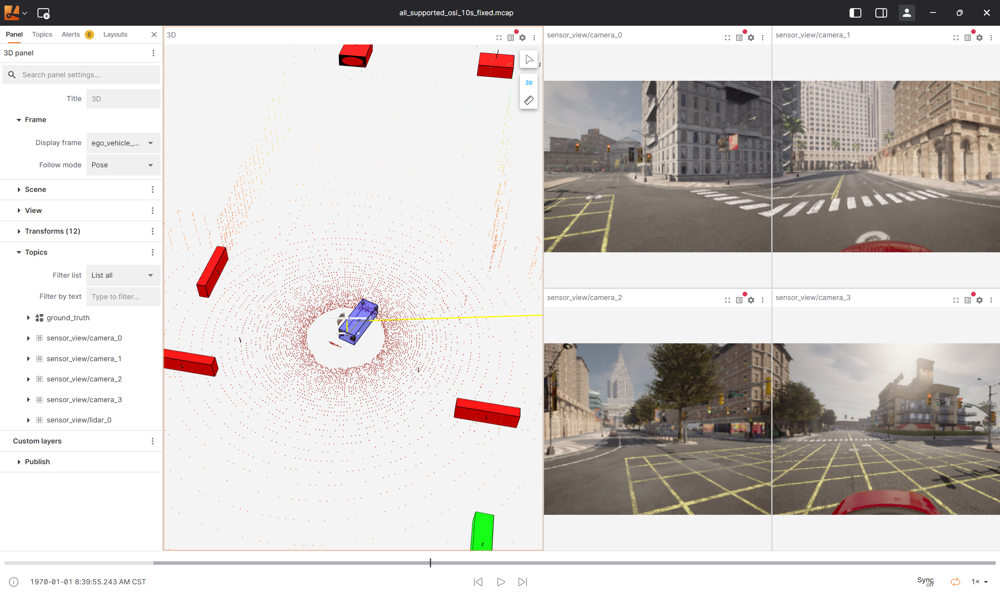

# CARLA OSI Publisher

[English](README.en.md)

基于 Python 的 CARLA 0.9.16 到 ASAM Open Simulation Interface（OSI）3.8.0
转换工具。当前版本支持录制 `GroundTruth`、`StreamingUpdate`，以及 RGB
相机和 ray-cast LiDAR 的 `SensorView`，输出格式为 `.osi` 或 `.mcap`。

CARLA 0.9.16 服务端、地图和仿真资源需要用户自行安装并启动。本项目只连接
CARLA 服务端，不包含或修改 CARLA 服务端。其余 Python 依赖均通过 PyPI
安装，并统一使用 `uv` 管理。

## 项目功能

### OSI 支持矩阵

| OSI 消息 | CARLA 转换 | `.osi` | `.mcap` |
| --- | :---: | :---: | :---: |
| `osi3.GroundTruth` | ✅ | ✅ | ✅ |
| `osi3.StreamingUpdate` | ✅ | ✅ | ✅ |
| `osi3.SensorView`：RGB 相机 | ✅ | ✅ 单相机 | ✅ 每个相机独立 channel |
| `osi3.SensorView`：ray-cast LiDAR | ✅ | ✅ | ✅ 独立 channel |
| `osi3.SensorViewConfiguration` | ⚠️ 嵌入 `SensorView` | ❌ 独立消息 | ❌ 独立 channel |
| `osi3.SensorData` | ❌ | ❌ | ❌ |
| `osi3.TrafficUpdate` | ❌ | ❌ | ❌ |

当前实现还提供：

- 使用 actor ID 或 `role_name` 选择 ego 车辆。
- 生成首帧完整、后续增量的 `StreamingUpdate`。
- 为 MCAP 写入 OSI、Protobuf 和 channel metadata。
- 使用项目级 `GroundTruthValidator` 检查当前已实现字段。
- 使用 `asam-osi-utilities` 将单类型 `.osi` trace 转换为 `.mcap`。

不支持 Radar、Semantic LiDAR、深度相机、目标检测、SensorData、UDP 或 ROS 2
实时发布。

## 快速开始

### 1. 准备 CARLA 服务端

单独安装并启动 CARLA 0.9.16 服务端。默认连接地址为
`127.0.0.1:2000`。

在 WSL 中连接运行于 Windows 的 CARLA 服务端时，通常需要使用 Windows
主机 IP

### 2. 安装 Python 环境

项目默认使用 Python 3.10。安装 `uv` 后，在仓库根目录执行：

```bash
uv sync
```

该命令会创建 `.venv` 并安装 CARLA Python API、`osi-python`、
`asam-osi-utilities`、Protobuf、NumPy 和 MCAP 相关依赖。不需要单独下载
`osi3`、`osi-python` 或 `asam-osi-utilities` 仓库，也不需要额外执行
`pip install`。

检查安装：

```bash
uv run carla-osi --version
```

### 3. 最小 Demo

以下命令由 publisher 创建一辆 `charger_2020` ego 车辆，并在同步模式下录制
5 秒数据：

```bash
uv run carla-osi record \
  --host 127.0.0.1 \
  --port 2000 \
  --sync \
  --duration-seconds 5 \
  --demo-scene \
  --no-static-objects \
  --compression zstd \
  --output carla_osi_demo.mcap
```

Demo 默认包含左、前、右、后四个 RGB 相机和一个 64 线 LiDAR：

| Channel | Protobuf 类型 | 内容 |
| --- | --- | --- |
| `ground_truth` | `osi3.GroundTruth` | 当前 CARLA 世界状态 |
| `streaming_update` | `osi3.StreamingUpdate` | 首帧完整、后续增量更新 |
| `sensor_view/camera_0` | `osi3.SensorView` | 左侧 RGB 相机 |
| `sensor_view/camera_1` | `osi3.SensorView` | 前方 RGB 相机 |
| `sensor_view/camera_2` | `osi3.SensorView` | 右侧 RGB 相机 |
| `sensor_view/camera_3` | `osi3.SensorView` | 后方 RGB 相机 |
| `sensor_view/lidar_0` | `osi3.SensorView` | ray-cast LiDAR |

`--no-static-objects` 用于避免每帧重复写入大量地图静态对象。需要完整静态环境
时可移除该选项，但文件体积和转换时间会明显增加。

## 使用已有交通场景

CARLA 官方 `generate_traffic.py` 可以生成 15 辆交通车辆和 1 辆 ego 车辆：

```bash
python3 /path/to/Carla/PythonAPI/examples/generate_traffic.py \
  --host 127.0.0.1 \
  --port 2000 \
  --number-of-vehicles 16 \
  --number-of-walkers 0 \
  --hero \
  --seed 42 \
  --tm-port 8000
```

该脚本默认持续推进 CARLA 同步 tick。保持脚本运行，并在另一个终端使用
`--wait-for-tick` 录制：

```bash
uv run carla-osi record \
  --host 127.0.0.1 \
  --port 2000 \
  --ego hero \
  --wait-for-tick \
  --duration-seconds 5 \
  --camera-yaw=-90 \
  --camera-yaw=0 \
  --camera-yaw=90 \
  --camera-yaw=180 \
  --no-static-objects \
  --compression zstd \
  --output traffic_capture.mcap
```

同一 CARLA 世界只能有一个同步主客户端：

- publisher 自己推进仿真时使用 `--sync`。
- `generate_traffic.py` 等其他客户端推进仿真时使用 `--wait-for-tick`。
- 不要让两个客户端同时调用 `world.tick()`。

## 输出格式

### `.osi`

`.osi` 是带 4 字节小端长度前缀的单类型 Protobuf trace。可分别录制：

```bash
# GroundTruth
uv run carla-osi groundtruth \
  --host 127.0.0.1 \
  --port 2000 \
  --ego hero \
  --wait-for-tick \
  --duration-seconds 5 \
  --update-mode groundtruth \
  --output ground_truth.osi

# StreamingUpdate
uv run carla-osi groundtruth \
  --host 127.0.0.1 \
  --port 2000 \
  --ego hero \
  --wait-for-tick \
  --duration-seconds 5 \
  --update-mode streaming \
  --output streaming_update.osi
```

单个相机或 LiDAR 的 `SensorView` 也可以写入 `.osi`。多传感器录制应使用
MCAP 的独立 channel。

### `.mcap`

`record` 直接生成多 channel MCAP。已有单类型 `.osi` 可以转换为 MCAP：

```bash
uv run carla-osi convert \
  ground_truth.osi \
  ground_truth.mcap \
  --input-type GroundTruth \
  --topic ground_truth \
  --compression zstd
```

检查 MCAP 中的 topic、schema、消息数量和 metadata：

```bash
uv run python examples/inspect_mcap.py carla_osi_demo.mcap
```

## OSI MCAP 可视化

OSI MCAP 可以使用 Lichtblick 配合
[asam-osi-converter 插件](https://github.com/Lichtblick-Suite/asam-osi-converter)
进行可视化。




插件使用 `GroundTruth.host_vehicle_id` 和
`vehicle_attributes.bbcenter_to_rear` 建立 `global`、ego 后轴及传感器坐标帧。
Demo 会绑定明确的 ego actor ID；当 CARLA 未提供轴位置属性时，publisher
使用车辆 bounding box 半长生成可重复的近似值。

## 详细支持范围

### GroundTruth

| 区域 | 状态 | 当前实现 |
| --- | --- | --- |
| 版本和时间戳 | ✅ | OSI `3.8.0`，使用 CARLA snapshot 仿真时间 |
| Ego 引用 | ✅ | actor ID 或 `role_name` |
| 车辆和行人 | ✅ | 位姿、尺寸、速度、加速度和角速度 |
| 车辆分类 | ⚠️ | 读取 OSI/CARLA 属性，否则为 `TYPE_UNKNOWN` |
| 车辆轴位置 | ⚠️ | 优先读取属性，否则按 bounding box 半长近似 |
| 车辆灯光 | ⚠️ | 基础映射前灯、远光、倒车灯、刹车灯和转向灯 |
| 静态环境对象 | ✅ | 转换配置的 `CityObjectLabel` |
| 交通标志 | ⚠️ | 限速、停车、让行和 fallback 类型 |
| 交通灯 | ⚠️ | ID、位姿、尺寸、颜色、模式和 icon |
| Lane/OpenDRIVE 拓扑 | ❌ | 未实现 |
| 天气和环境条件 | ❌ | 未实现 |

### StreamingUpdate

| 字段 | 状态 | 行为 |
| --- | --- | --- |
| `stationary_object_update` | ✅ | 默认仅首帧发送 |
| `moving_object_update` | ✅ | 每帧发送 |
| `traffic_sign_update` | ✅ | 默认仅首帧发送 |
| `traffic_light_update` | ✅ | 每帧发送 |
| `obsolete_id` | ✅ | 报告消失的移动对象和交通灯 |
| 环境条件和主车内部数据 | ❌ | 未实现 |

`StreamingUpdate` 是 OSI 标准顶层消息。消费端必须跨帧保存状态并处理
`obsolete_id`；MCAP 不会自动将增量更新合并成完整场景。

### SensorView

| 区域 | 状态 | 当前实现 |
| --- | --- | --- |
| RGB 图像 | ✅ | CARLA BGRA 转换为 `RGB_U8_LIN` |
| 相机标定 | ✅ | 分辨率、水平/垂直 FOV 和安装位姿 |
| LiDAR 点云 | ✅ | 方向、双程飞行时间和信号强度 |
| `sensor_id` / `host_vehicle_id` | ✅ | 使用独立 ID namespace 并引用 ego |
| `global_ground_truth` | ❌ | 不嵌入 SensorView |
| Radar、Semantic LiDAR、深度相机 | ❌ | 未实现 |
| SensorData 检测和跟踪 | ❌ | 未实现 |

## 坐标和 ID

默认坐标转换：

```text
OSI.x   = CARLA.x
OSI.y   = -CARLA.y
OSI.z   = CARLA.z
OSI.yaw = -CARLA.yaw
```

需要保留 CARLA 原生 Y 轴时使用 `--no-flip-y`。

OSI ID 使用高 8 位 namespace：

| 实体 | Namespace |
| --- | ---: |
| CARLA actor | 1 |
| CARLA environment object | 2 |
| CARLA traffic light | 3 |
| Lane 预留 | 4 |
| CARLA sensor | 5 |

## 项目结构

```text
src/carla_osi_publisher/
  carla.py       CARLA 连接和同步控制
  cli.py         carla-osi 命令行入口
  groundtruth.py GroundTruth 转换
  streaming.py   StreamingUpdate 转换
  sensorview.py  RGB 相机和 LiDAR SensorView 转换
  mcap.py        OSI MCAP writer 和 .osi 转换
  trace.py       长度前缀 .osi writer
  validator.py   GroundTruth 项目级校验
examples/
  inspect_mcap.py
tests/
docs/images/
```

生成的 `.osi`、`.mcap`、虚拟环境、构建产物和缓存均已通过 `.gitignore`
排除，不会进入仓库。

## 已知限制

- CARLA 服务端、地图和场景资源不随项目发布。
- `record --demo-scene` 只负责创建 ego 车辆，不生成完整交通流。
- 完整静态 GroundTruth 会显著增加 CPU 开销和 MCAP 文件体积。
- `.osi` 不适合表示多个独立传感器 channel。
- `SensorViewConfiguration` 仅嵌入 SensorView，不独立发布。
- `asam-osi-converter` 不会从 `streaming_update` 重建完整 3D 场景。
- 当前没有 UDP、ROS 2 或其他实时网络 publisher。
- `GroundTruthValidator` 是项目级检查，不等同于完整 OSI 一致性认证。

## 许可证

本项目使用 Mozilla Public License 2.0（MPL-2.0），详见 [LICENSE](LICENSE)。
