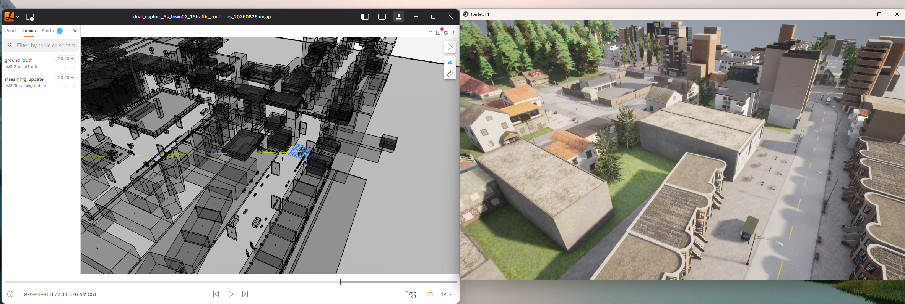

# CARLA OSI Publisher

[English](README.en.md)

基于 Python 的 CARLA 0.9.16 到 ASAM Open Simulation Interface（OSI）3.8.0
消息转换程序。

CARLA 0.9.16 服务端需要用户单独下载、安装并启动。本项目不包含 CARLA
服务端程序、地图和仿真资源。除 CARLA 服务端外，项目所需的 Python 依赖均
从 PyPI 安装，并统一使用 `uv` 创建和管理虚拟环境。

## 项目功能

当前 MVP 提供以下能力：

- 将 CARLA 车辆和行人转换为 `osi3.GroundTruth`。
- 转换 CARLA 静态环境对象、交通标志和交通灯。
- 通过 actor ID 或 `role_name` 选择 ego 车辆。
- 生成首帧完整、后续增量的 `osi3.StreamingUpdate`。
- 在一个 MCAP 中同时输出 `ground_truth` 和 `streaming_update` 两个 channel。
- 写入 OSI 文件 metadata、protobuf descriptor 和 channel metadata。
- 对当前已填充的 GroundTruth 字段进行项目级校验。

项目当前不负责传感器生成、相机或激光雷达数据转换，也不包含 UDP、ROS 2
等实时网络发布器。

### OSI 支持矩阵

当前只实现 CARLA 仿真状态到以下两种 OSI 消息的转换：

| OSI 消息 | CARLA 转换 | `.osi` 输出 | `.mcap` 输出 |
| --- | :---: | :---: | :---: |
| `osi3.GroundTruth` | ✅ | ✅ | ✅ 双 channel |
| `osi3.StreamingUpdate` | ✅ | ✅ | ✅ 双 channel |

其他 OSI 消息暂不属于当前项目范围。

## 快速开始

以下示例假设 CARLA 0.9.16 服务端已经由用户单独安装并启动，并且可以通过
`127.0.0.1:2000` 访问。

### 1. 安装依赖

如果尚未安装 `uv`，Linux 或 WSL 中可以执行：

```bash
curl -LsSf https://astral.sh/uv/install.sh | sh
```

在项目根目录执行下面一条命令即可创建虚拟环境并安装全部 Python 依赖：

```bash
uv sync
```

如果 publisher 在 WSL 中运行，CARLA Python API 需要安装在 WSL 的 Python
环境中；连接 Windows CARLA 服务端时，通常应使用 Windows 主机 IP，而不是
`127.0.0.1`。

CARLA 服务端不由 `uv` 或 `pip` 安装。请从 CARLA 官方发行包单独安装并启动
CARLA 0.9.16 服务端。

检查安装结果：

```bash
uv run carla-osi --version
```

### 2. 使用 CARLA 官方脚本生成交通

CARLA 官方 `generate_traffic.py` 可以生成自动驾驶车辆，并将其中一辆标记为
`role_name=hero`：

```bash
python3 /path/to/Carla/PythonAPI/examples/generate_traffic.py \
  --host 127.0.0.1 \
  --port 2000 \
  --number-of-vehicles 16 \
  --number-of-walkers 0 \
  --hero \
  --seed 42 \
  --tm-port 8000
```

在 Windows 环境中，如果系统没有 `python3` 命令，可将上面的 `python3`
替换为 `python`。

`--number-of-vehicles 16 --hero` 表示 15 辆交通车辆加 1 辆 ego 车辆。
官方脚本默认作为同步主客户端持续推进 CARLA tick，请保持该终端运行。

## 核心使用方式

车辆生成后，在另一个终端执行下面的命令。录制完成后，在交通生成终端按
`Ctrl+C` 停止。

命令行入口为 `carla-osi groundtruth`。通过 `--update-mode` 选择消息类型，
通过输出文件扩展名选择文件格式。

### GroundTruth 输出 `.osi`

```bash
uv run carla-osi groundtruth \
  --host 127.0.0.1 \
  --port 2000 \
  --ego hero \
  --sync \
  --duration-seconds 5 \
  --update-mode groundtruth \
  --output ground_truth.osi
```

### StreamingUpdate 输出 `.osi`

```bash
uv run carla-osi groundtruth \
  --host 127.0.0.1 \
  --port 2000 \
  --ego hero \
  --sync \
  --duration-seconds 5 \
  --update-mode streaming \
  --output streaming_update.osi
```

首帧包含静态对象和交通标志，后续帧包含移动对象和交通灯更新。接收端需要
保存对象状态并处理 `obsolete_id`。

### 双通道输出 `.mcap`

```bash
uv run carla-osi groundtruth \
  --host 127.0.0.1 \
  --port 2000 \
  --ego hero \
  --sync \
  --duration-seconds 5 \
  --update-mode dual \
  --output capture.mcap
```

该 MCAP 包含两个 channel：

| Channel | 消息 |
| --- | --- |
| `ground_truth` | `osi3.GroundTruth` |
| `streaming_update` | `osi3.StreamingUpdate` |

## OSI MCAP 可视化

生成的 OSI MCAP 包可以使用 Lichtblick 配合
[asam-osi-converter 插件](https://github.com/Lichtblick-Suite/asam-osi-converter)
进行可视化。



## 详细支持范围

### GroundTruth 字段覆盖

| OSI 区域 | 状态 | 当前实现 |
| --- | --- | --- |
| `GroundTruth.version` | 支持 | 固定为 OSI `3.8.0`。 |
| `GroundTruth.timestamp` | 支持 | 使用 CARLA snapshot 仿真时间。 |
| `GroundTruth.host_vehicle_id` | 支持 | 按数字 actor ID 或 `role_name` 查找。 |
| `GroundTruth.moving_object` | 支持 | 转换 `vehicle.*` 和 `walker.pedestrian.*`。 |
| 移动物体尺寸 | 支持 | 将 CARLA bounding box 转换为长度、宽度和高度。 |
| 移动物体位姿 | 支持 | 转换位置和姿态，支持侧向轴翻转配置。 |
| 移动物体速度 | 支持 | 使用 CARLA actor velocity。 |
| 移动物体加速度 | 支持 | 使用 CARLA actor acceleration。 |
| 移动物体角速度 | 支持 | 将 CARLA angular velocity 转换为 OSI orientation rate。 |
| 车辆分类 | 部分支持 | 读取 `osi_vehicle_type` 或 `object_type`，否则为 `TYPE_UNKNOWN`。 |
| 车辆属性 | 部分支持 | 车轮数、车轮半径、离地间隙和包围盒偏移量取决于 blueprint 属性。 |
| 车辆灯光 | 部分支持 | 映射远光、近光、倒车灯、刹车灯和转向灯状态。 |
| `stationary_object` | 支持 | 转换配置的 `CityObjectLabel` 环境对象。 |
| 静态对象分类 | 部分支持 | 基础支持建筑、障碍物、电线杆、植被、墙体和桥梁等分类。 |
| `traffic_sign` | 部分支持 | 支持限速、停车、让行以及 fallback 标志类型。 |
| 交通标志数值 | 部分支持 | 从名称中解析限速数值和单位。 |
| `traffic_light` | 部分支持 | 支持 ID、位姿、尺寸、颜色、模式和 icon。 |
| 交通灯详细几何 | 未实现 | 不包含灯泡、箭头、车道关联和信号组。 |
| Lane 网络 | 未实现 | 不包含完整 lane、lane boundary、reference line 和 OpenDRIVE 拓扑。 |
| 环境条件 | 未实现 | 不转换 CARLA 天气和环境条件。 |
| 主车内部数据 | 未实现 | 不输出独立的 `HostVehicleData`。 |
| 传感器数据 | 未实现 | 不转换相机、激光雷达、雷达和检测结果。 |

### StreamingUpdate 字段覆盖

| 字段 | 状态 | 行为 |
| --- | --- | --- |
| `version` | 支持 | 设置为 OSI `3.8.0`。 |
| `timestamp` | 支持 | 使用当前 CARLA snapshot 时间。 |
| `stationary_object_update` | 支持 | 默认仅首帧发送。 |
| `moving_object_update` | 支持 | 首帧和后续帧都发送。 |
| `traffic_sign_update` | 支持 | 默认仅首帧发送。 |
| `traffic_light_update` | 支持 | 首帧和后续帧都发送。 |
| `environmental_conditions_update` | 未实现 | 不转换 CARLA 天气。 |
| `host_vehicle_data_update` | 未实现 | 不转换主车内部数据。 |
| `obsolete_id` | 支持 | 报告后续 snapshot 中消失的移动对象和交通灯。 |

`StreamingUpdate` 是 OSI 标准定义的顶层消息，不是本项目自定义扩展。
它是增量协议，接收端必须跨消息保存对象状态。MCAP 只负责存储消息和
metadata，不会自动合并 StreamingUpdate。

## 校验器

`GroundTruthValidator` 是针对当前 MVP 的项目级校验器，检查：

- OSI interface version 存在且为 `3.8.0`。
- timestamp 存在。
- 使用 `--require-host-vehicle` 时，`host_vehicle_id` 存在。
- 已支持对象的 ID 存在并且唯一。
- 移动物体和静态物体的 base 字段存在。
- 交通标志和交通灯的 base 字段存在。
- `host_vehicle_id` 确实引用了一个移动物体。

它不是完整的官方 OSI 一致性验证器。对于 CARLA 无法提供的数据，项目会保持
字段未设置，而不是伪造数值。

## 坐标系

默认坐标转换：

```text
OSI.x   = CARLA.x
OSI.y   = -CARLA.y
OSI.z   = CARLA.z
OSI.yaw = -CARLA.yaw
```

如果消费端要求使用 CARLA 原生侧向轴，使用 `--no-flip-y`。同一个 trace 内
必须保持坐标转换方式一致。

## ID 策略

publisher 使用带 namespace 的 64 位 OSI ID：

| 源实体 | Namespace |
| --- | ---: |
| CARLA actor | 1 |
| CARLA environment object | 2 |
| CARLA traffic light 和 bulb index | 3 |
| 未来 lane ID 预留 | 4 |

namespace 用于避免 actor、环境对象和交通灯 ID 冲突。超出 OSI payload 范围的
CARLA 环境对象 ID 会被确定性折叠，并在同一个 mapper 实例内处理冲突。

## 架构

```text
CARLA 0.9.16 服务端
        |
        | CARLA Python API
        v
CarlaClient
        |
        v
GroundTruthBuilder ------> osi3.GroundTruth
        |
        +-----------------> StreamingUpdateBuilder
        |                           |
        |                           v
        |                   osi3.StreamingUpdate
        v
GroundTruthValidator
        |
        +--> length-prefixed .osi trace
        +--> 单 channel MCAP
        +--> 双 channel MCAP
```

运行时行为：

- `--sync` 由 publisher 调用 `world.tick()`，退出时恢复原同步设置。
- `--wait-for-tick` 观察其他 CARLA 客户端推进的 snapshot。
- GroundTruth 模式先在内存中收集消息，再写入 `.osi`。
- StreamingUpdate 模式增量写入消息。
- Dual 模式增量写入两个 MCAP channel。
- 当前没有网络发布器。

## 项目结构

```text
src/
  carla_osi_publisher/
    carla.py       CARLA 连接和同步/异步步进
    cli.py         carla-osi 命令行入口
    config.py      publisher 和 GroundTruth 配置
    geometry.py    坐标、位姿、尺寸和时间转换
    groundtruth.py CARLA 到 GroundTruth 的转换
    ids.py         OSI namespace ID 映射
    mcap.py        单 channel 转换和双 channel MCAP writer
    osi.py         OSI 与 CARLA 依赖的延迟加载
    streaming.py   GroundTruth 到 StreamingUpdate 的转换
    trace.py       长度前缀单 channel trace writer
    validator.py   MVP GroundTruth 校验器
    version.py     项目和 OSI 版本常量
examples/
  inspect_mcap.py  MCAP topic、schema、数量和 metadata Demo
tests/
  fakes.py       CARLA 形状测试替身
  test_*.py      转换、校验、trace 和 MCAP 测试
pyproject.toml   包元数据和 uv 配置
uv.lock         可复现依赖锁文件
```

## 已知限制

- CARLA 交通生成不属于 publisher CLI，需要使用 `generate_traffic.py` 或其他
  交通客户端。
- 尚无传感器回调和传感器创建逻辑。
- 尚未输出完整 lane 拓扑和 OpenDRIVE 语义。
- 交通标志和交通灯目前只有基础映射。
- `asam-osi-converter` 当前可以可视化 `ground_truth` topic，但不会从
  `streaming_update` topic 重建 3D 场景。
- StreamingUpdate 消费端必须实现跨消息状态保存和 `obsolete_id` 处理。
- CARLA 服务端和地图资源不随本项目发布，需要用户单独安装和准备。

## 路线图

1. 增加带生命周期管理的 CARLA 交通生成辅助工具。
2. 增加相机、激光雷达和雷达的 `SensorView` 转换。
3. 增加 `SensorViewConfiguration` 和传感器创建。
4. 增加 `TrafficUpdate` 输入及外部 actor 状态应用。
5. 增加 lane boundary、lane 拓扑和 OpenDRIVE 引用。
6. 增加 UDP、ROS 2 和实时 MCAP 网络输出。
7. 为可视化客户端增加原生 StreamingUpdate 状态重建。

## 许可证

本项目使用 Mozilla Public License 2.0（MPL-2.0），详见 [LICENSE](LICENSE)。
